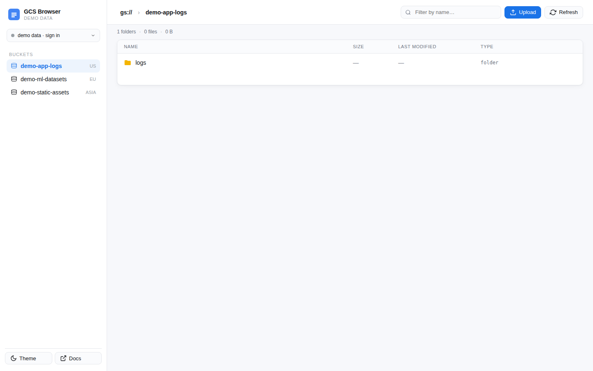
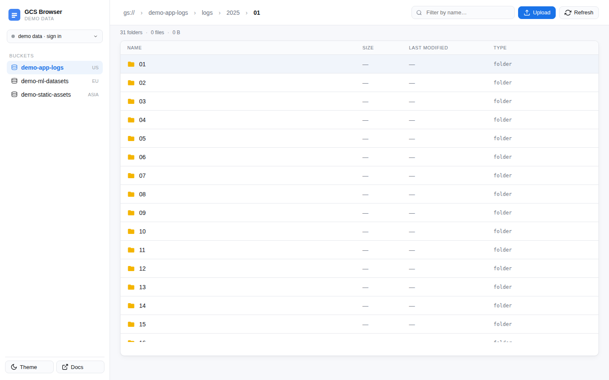
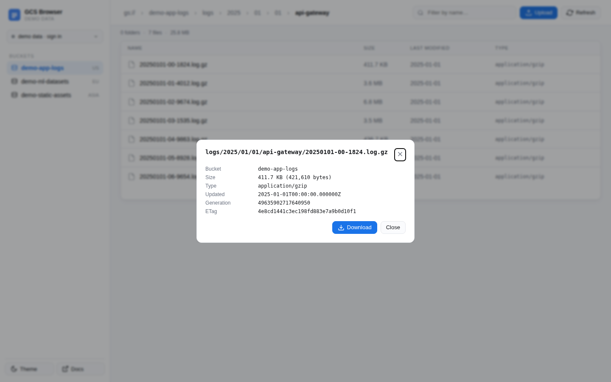
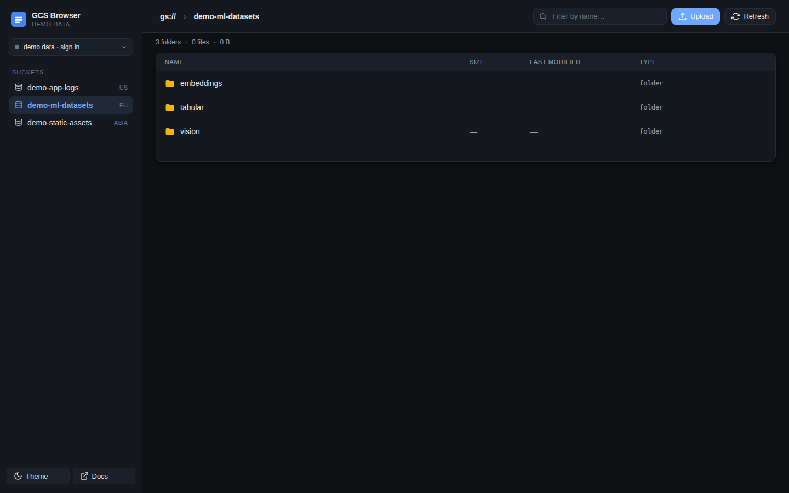
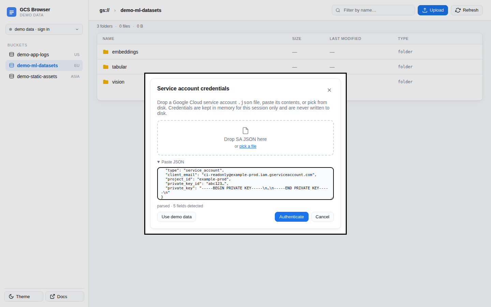
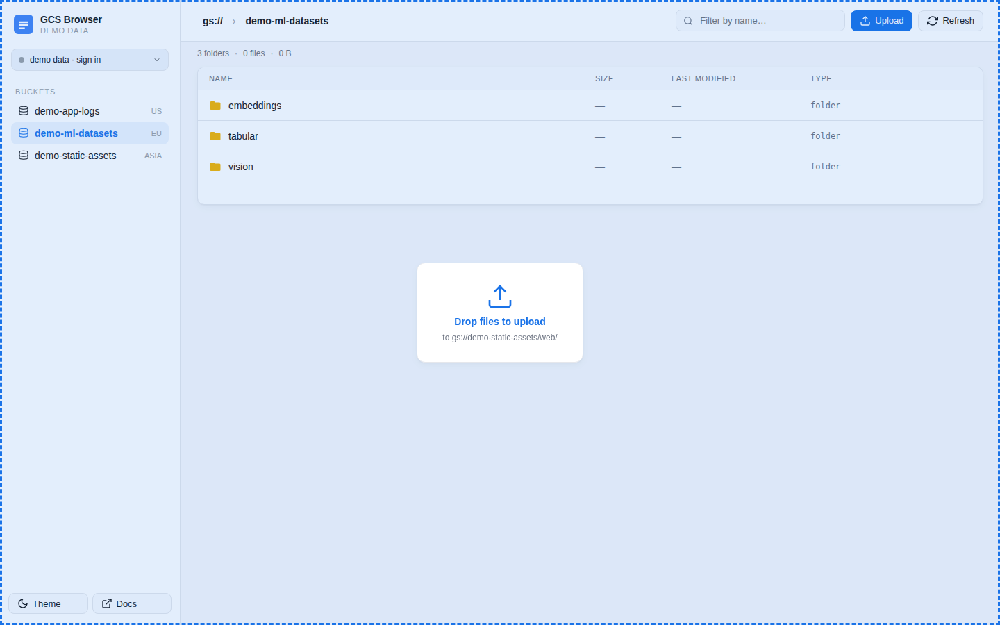
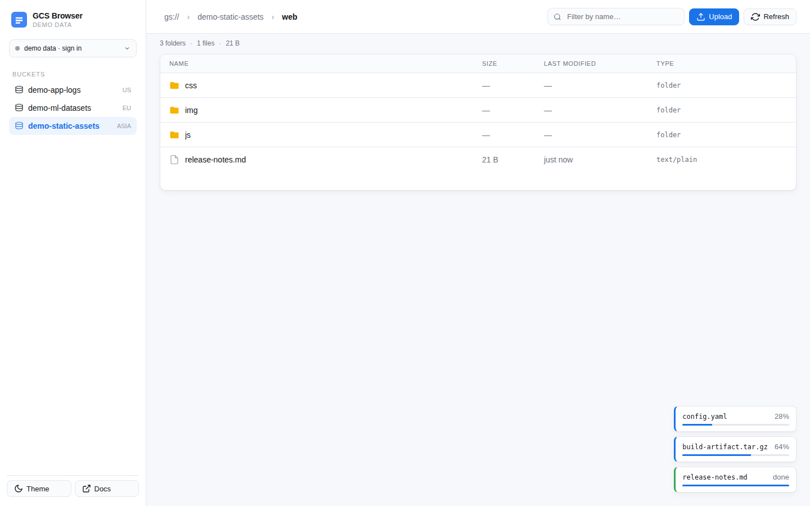
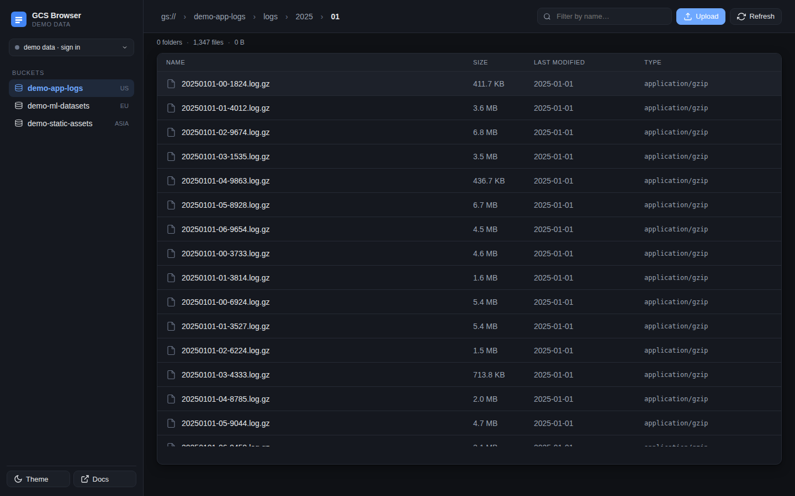

# gcs-webui

A small, fast web UI for browsing **Google Cloud Storage** buckets — the same
browse-and-download flow as the GCS / S3 web consoles, but trimmed down to
something a Python or Java developer can `docker run` in ten seconds.

* Authentication via service-account JSON (mount it, pass via env, **or swap from the UI per browser session**).
* Buckets · folder tree · object metadata · streaming download.
* **Drag-and-drop file upload** with per-file progress.
* Handles 1000+ object listings smoothly (server-side paging + infinite scroll).
* Per-session credential isolation: two users with different SA files never see each other's state.
* Light / dark theme, keyboard-friendly, Chrome-tested.
* No build step, no Node, no SPA bundle. Image is < 200 MB.

## Screenshots










## Quick start (Docker)

```bash
# point GOOGLE_APPLICATION_CREDENTIALS at a mounted SA file
docker run --rm -p 8080:8080 \
  -v $PWD/sa.json:/secrets/sa.json:ro \
  -e GOOGLE_APPLICATION_CREDENTIALS=/secrets/sa.json \
  gcs-webui:latest
```

Then open <http://localhost:8080>.

Or with compose (also enforces read-only fs / dropped caps / 256 MB limit):

```bash
docker compose up --build
```

## Demo mode (no credentials)

Set `GCS_DEMO_MODE=1` to load the in-memory fake dataset (3 buckets, 1500+
objects). Useful for trying the UI before wiring up real credentials.

```bash
docker run --rm -p 8080:8080 -e GCS_DEMO_MODE=1 gcs-webui:latest
```

## Running locally

```bash
pip install -r requirements.txt
GCS_DEMO_MODE=1 uvicorn app.main:app --port 8080
```

## Auth options

| Source | Effect |
| --- | --- |
| **In-UI sign-in** (click the credentials pill) | Drop / paste / pick a SA JSON. Scoped to your browser session only — multiple users with different SAs do not see each other's data. Held in memory, never written to disk. |
| `GOOGLE_APPLICATION_CREDENTIALS` env | Default credentials used when a session has not authenticated. |
| `GCS_SA_JSON` env | Full SA JSON inline (K8s secret friendly), same role as above. |
| `GCS_DEMO_MODE=1` env | Force demo data, ignore credentials. |

If nothing is configured the app falls back to demo mode so the UI still loads.

## Uploads

* Click **Upload** in the toolbar to pick files, or drag-and-drop files onto any part of the page.
* Files land at the current `gs://<bucket>/<prefix>/` path with a per-file progress toast.
* Available whenever the active credential has `storage.objects.create` (server-side credentials, env credentials, or a SA you signed in with). The fake/demo backend also accepts uploads (in-memory only).

## Tests

```bash
pip install -r requirements-dev.txt
pytest                                      # api smoke tests
python -m tests.screenshot_capture          # regenerates tests/screenshots/
```

The screenshot script boots the app in demo mode and drives Chromium via
Playwright. Set `PLAYWRIGHT_CHROMIUM_PATH` to override the browser binary.

## See also

* [`TECH_STACK.md`](TECH_STACK.md) — design choices and trade-offs.
